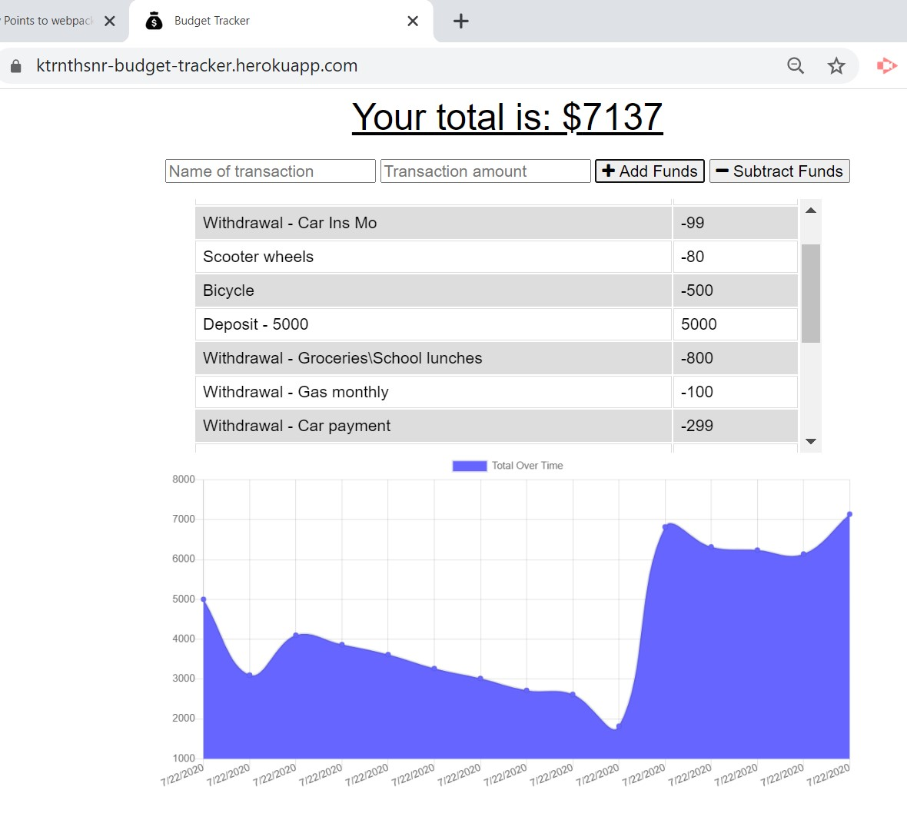

# Budget Tracker

Mobile web application for tracking budget deposits and expenses both online and offline, with focus on adding caching to manage NoSQL storage for transactional information if temporarily offline, and improving page load performance through auditing and bundling.

## GitHub URL

* https://github.com/ktrnthsnr/Budget-Tracker

## Heroku website

* https://ktrnthsnr-budget-tracker.herokuapp.com/

## Table of Contents

* [Description](#description)
* [Technology](#technology)
* [Installations](#installations)
* [Usage](#usage)
* [Testing](#testing)
* [Userstory](#Userstory)
* [Contribution](#contribution)

## Description

* This project focuses on allowing for mobile application offline functionality. In this application, a user will be able to add expenses and deposits to their budget with or without an internet connection. For example, if a user were to start a transaction then have their connection interrupted and went offline, their transaction or CRUD operation (where CRUD stands for any of these actions Create, Read, Update, Delete) to the MongoDB database, these operations would complete once the user resumed their internet connection and the application came back online.

* Optimizations and performance improvements completed to allow for quicker load time, offline functionality, and mobile app installation of a PWA:

    * Included webpack modules to bundle js files for quicker page load response
    * Used Web API IndexedDB, a NoSQL client-side storage browser-based API based in which data is stored in an Object Store in the browser and allows for asynchronous operations
    * Added a service worker to leverage browser-based storage and manage offline access and functionality by caching assets
    * Converted the mobile app to a Progressive Web Application (PWA), by adding a manifest JSON file so that the application can installed on a mobile device's homescreen without requiring download from an app store

* The web application is also deployed to and hosted on Heroku, serving the backend Moongoose\MongoDB through an mLab add-on.

## Technology

MongoDB, Express.js, Mongoose JS, Node.js, JavaScript, ES6, npm, Heroku, mLab, Compression,  Morgan, Webpack, Webpack CLI, Compression, Morgan

## Installations

- Prereq: install VSCode, Node.js, and MongoDB (see below for more info)

- After cloning the GitHub repo to your local drive, run the following in the VSCode command-line terminal
- Install all components listed within the package.json file for npm
    - $ `npm i`

- Otherwise, for custom individual component installations, start by initializing npm and creating a new package.json
    - $ `npm init --y` or $ `npm install`
    - Create a .gitignore file in the root and add `node_modules` to this file
    - If you need to re-add any of the dependencies, run $ `npm install`

- For backend server, database and middleware installations:
    - Install npm express, more info https://www.npmjs.com/package/express
    - $ `npm install express`
    - Manaully update the package.json to  `"main": "server.js",` instead of index.js
    - Install `MongoDB`, by first creating a `c:/data/db` directory on your root, then install the Community Server from https://www.mongodb.com/try/download/community, excluding the compass from the installation, and adding the /bin folder to the environment variable PATH.
    - Install the MongooseJS library
    - $ `npm install mongoose`

- For webpack, jQuery, and bootstrap installations:
    - Install webpack and webpack CLI
    - $ `npm i -D webpack webpack-cli`
    - Check webpack is installed, checking for the version
    - $ `webpack -v`
    - If you received this error, `webpack: command not found` resolve by running this
    - $ `npm run webpack -v`
    - Install the jQuery package
    - $ `npm i jQuery`
    - Install bootstrap
    - $ `npm i bootstrap`
    - Install popper.js
    - $ `npm i popper.js`
    - Install the webpack-bundle-analyzer
    - $ `npm install -D webpack-bundle-analyzer`
    - Installed file-loader to optimize image and JS files
    - $ `npm install -D file-loader`
    - Installed webpack loader
    - $ `npm install image-webpack-loader`
    - Installed dev server to view HTTPS locally, port 8080, starting $`npm run start:dev`
    - $ `npm install webpack-dev-server -D`
    - Installed to convert the app to a mobile PWA
    - $ `npm i -D webpack-pwa-manifest`

## Usage

- The website for the Budget Tracker application has been deployed as a Heroku website app,
https://ktrnthsnr-budget-tracker.herokuapp.com/

- To view the site locally, run `npm start` and browse on the http://localhost:3001
- Here is a walkthrough to demonstrate the application of IndexedDB, the browser-based API providing client storage and asynchronous operations whereby a transaction added when offline can be applied once back online.
https://drive.google.com/file/d/1iCrYaJp47Ycl0ZLlvpwQlJcXY7TP8fs5/view

## Testing

- To create a `bundle.js` file with webpack
    - First run `npm i -D webpack webpack-cli` in your command line to install the webpack modules.
    
    - Then run in the bash terminal `npm run build`
        - This will start an interactive tree map and will render a report.html in the browser locally, showing each bundle size being loaded.
        - Running the build will also create a manifest.json file, converting the app to a PWA. (Note, webpack is not needed to create a PWA, it is just what we're using for this project.) 
    - Note, in this project exercise, the mode under the webpack.config.js is set to Development mode not Production mode. (Production mode would Uglify and minimize files.)

- To register and install a Service Worker, run the following
    - $ `npm run seed`
    - $ `npm start`

 - To view the site `locally`, open a browser `http://localhost:3001` in Chrome and open DevTools or F12.  Within the Application tab, click Cache Storage on the menu to view if the files listed in service-worker.js are cached.

 - To view the application on the `development` server, run on your bash terminal and view on the browser at `http://localhost:8080`
    - $ `npm run start:dev`

## Userstory

AS AN avid traveler
I WANT to be able to track my withdrawals and deposits with or without a data/internet connection
SO THAT my account balance is accurate when I am traveling 

## Contribution

ktrnthsnr

### ©️2020 ktrnthsnr
